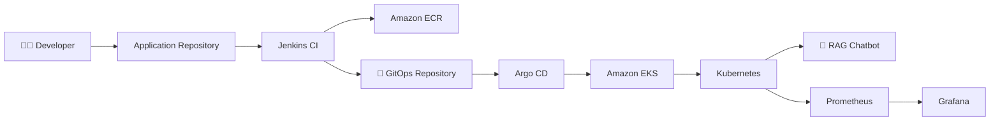
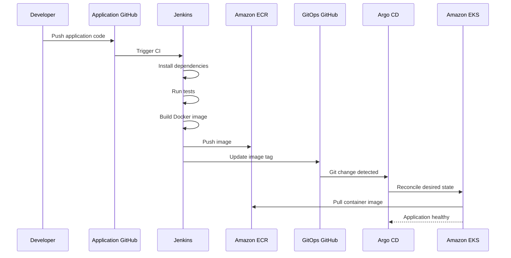

# ☸️ RAG Chatbot — GitOps Deployment

<p align="center">


</p>

<p align="center">

## 🌱 Git is the Source of Truth

### Kubernetes deployment for the RAG Chatbot using GitOps, Argo CD and Amazon EKS.

</p>

---

# 📌 What Is This Repository?

This repository contains the **deployment configuration** for the RAG chatbot.

Instead of allowing Jenkins to directly modify the Kubernetes cluster, this project uses a GitOps architecture.

The desired Kubernetes state is stored in Git.

```text
GitHub
  │
  ▼
GitOps Repository
  │
  ▼
Argo CD
  │
  ▼
Amazon EKS
  │
  ▼
Kubernetes
  │
  ▼
RAG Chatbot
```

This repository is intentionally separated from the application source repository.

---

# 🧭 Table of Contents

* [GitOps Architecture](#-gitops-architecture)
* [Why GitOps](#-why-gitops)
* [Repository Structure](#-repository-structure)
* [Deployment Flow](#-deployment-flow)
* [Kubernetes Architecture](#-kubernetes-architecture)
* [Application Deployment](#-application-deployment)
* [Kubernetes Service](#-kubernetes-service)
* [Argo CD](#-argo-cd)
* [Self-Healing](#-self-healing)
* [Prometheus](#-prometheus)
* [Grafana](#-grafana)
* [Monitoring the RAG Application](#-monitoring-the-rag-application)
* [Deployment Verification](#-deployment-verification)
* [Troubleshooting](#-troubleshooting)
* [Security](#-security)
* [Successful Deployment](#-successful-deployment)
* [Interview Explanation](#-interview-explanation)
* [Future Improvements](#-future-improvements)

---

# 🌱 GitOps Architecture

The architecture is based on the principle:

> **Git is the source of truth for the desired Kubernetes state.**



---

# 🔥 Why GitOps?

A traditional CI/CD deployment might look like:

```text
Jenkins
   │
   ├── docker build
   ├── docker push
   └── kubectl apply
```

This project deliberately uses:

```text
Jenkins
   │
   ├── docker build
   ├── docker push
   │
   └── update Git
             │
             ▼
        GitOps Repo
             │
             ▼
          Argo CD
             │
             ▼
          Kubernetes
```

### Why?

Because Git provides:

* 📜 Audit history
* 🔄 Version control
* 🔍 Visibility
* ↩️ Easy rollback
* 🧩 Declarative configuration
* 🔐 Reduced direct cluster access
* ♻️ Automated reconciliation

---

# 📁 Repository Structure

The deployment repository is organized around Kubernetes configuration.

Example structure:

```text
rag-chatbot-gitops/
│
├── app/
│   ├── deployment.yaml
│   └── service.yaml
│
└── README.md
```

The `app/` directory represents the Kubernetes desired state for the chatbot.

---

# 🔄 Deployment Flow

The complete delivery flow is:



---

# 🧩 Application Deployment

The Kubernetes Deployment manages the chatbot workload.

Conceptually:

```text
Deployment
    │
    └── ReplicaSet
           │
           └── Pod
                │
                └── RAG Chatbot Container
```

The container image is pulled from Amazon ECR.

Example image:

```yaml
image: 127372371582.dkr.ecr.us-east-1.amazonaws.com/rag-chatbot:build-8
```

> The `build-8` image was the successfully validated build during the project deployment.

---

# ☸️ Kubernetes Deployment

The application was deployed into the namespace:

```text
rag-chatbot
```

The deployment was:

```text
rag-chatbot
```

The application container exposed:

```text
8501
```

which is the Streamlit application port.

---

# 🌐 Kubernetes Service

The application was exposed using a Kubernetes `LoadBalancer` Service.

Conceptually:

```text
Internet
   │
   ▼
AWS Load Balancer
   │
   ▼
Kubernetes Service
   │
   ▼
Pod
   │
   ▼
Streamlit :8501
```

The Kubernetes Service handled traffic routing from the load balancer to the application pod.

---

# 🧭 Ingress vs LoadBalancer

This project used a `LoadBalancer` Service for the application.

The important distinction is:

### LoadBalancer

Provides an external cloud load balancer for a Kubernetes Service.

```text
Internet
   ↓
AWS Load Balancer
   ↓
Service
   ↓
Pod
```

### Ingress

Provides HTTP/HTTPS routing rules.

For example:

```text
example.com/
example.com/chat
example.com/api
```

could be routed to different Kubernetes Services.

Ingress can be added later if multiple applications or path/host-based routing are required.

---

# 🧭 Argo CD

Argo CD is the Continuous Delivery / GitOps component.

Its responsibility is:

```text
Git Repository
      ↓
Desired State
      ↓
Argo CD
      ↓
Kubernetes
```

The Argo CD Application was configured to watch:

```text
Repository:
https://github.com/adityarana021/rag-chatbot-gitops.git
```

Branch:

```text
main
```

Path:

```text
app
```

Destination:

```text
https://kubernetes.default.svc
```

Namespace:

```text
rag-chatbot
```

---

# 🔁 Argo CD Reconciliation

The key idea is reconciliation.

Suppose Git says:

```text
rag-chatbot:build-8
```

but the cluster is running:

```text
rag-chatbot:build-7
```

Argo CD detects the difference.

```text
Git
build-8
  │
  │ desired state
  ▼
Argo CD
  │
  │ difference detected
  ▼
Kubernetes
build-7
```

Argo CD then reconciles the cluster toward the Git-defined state.

---

# ❤️ Self-Healing

Automated self-healing was enabled for the Argo CD application.

This means the Git repository remains the desired state.

For example:

```text
Git:
replicas = 1
image = build-8
```

If someone manually changes the cluster:

```text
replicas = 0
```

Argo CD can detect the drift and reconcile the cluster back toward the Git state.

This is one of the key benefits of GitOps.

---

# 🧹 Automated Pruning

Argo CD was configured with automated pruning.

This means resources removed from the desired Git configuration can also be removed from the cluster during reconciliation.

Conceptually:

```text
Git
  │
  ├── Deployment
  ├── Service
  └── Config
       │
       ▼
     Argo CD
       │
       ▼
    Kubernetes
```

Git therefore becomes the authoritative declaration of what should exist.

---

# 📊 Monitoring Architecture

The Kubernetes environment was monitored using the Prometheus Operator / `kube-prometheus-stack`.

The architecture:

```text
Kubernetes
    │
    ├── Nodes
    ├── Pods
    ├── Deployments
    ├── Services
    └── Kubernetes Components
             │
             ▼
         Prometheus
             │
             ▼
          Grafana
```

---

# 🔥 Prometheus

Prometheus collects and stores time-series metrics.

During the deployment, the monitoring stack successfully ran components including:

* Prometheus
* Prometheus Operator
* Alertmanager
* kube-state-metrics
* node-exporter

These components provide visibility into the Kubernetes environment.

---

# 📈 Grafana

Grafana was used to visualize Prometheus metrics.

Dashboards included Kubernetes-related information such as:

* Cluster resources
* Node resources
* Pod state
* CoreDNS
* Alertmanager
* Kubernetes object metrics

Grafana was accessed locally through Kubernetes port-forwarding during testing.

Example:

```bash
kubectl port-forward -n monitoring svc/monitoring-grafana 3000:80
```

Then:

```text
http://localhost:3000
```

---

# 🤖 Monitoring the RAG Application

A custom Prometheus query was tested for the RAG chatbot:

```promql
kube_pod_status_phase{
  namespace="rag-chatbot",
  phase="Running"
}
```

This allows the running state of the chatbot pod to be visualized.

Conceptually:

```text
RAG Pod
   │
   ▼
kube-state-metrics
   │
   ▼
Prometheus
   │
   ▼
Grafana
```

---

# 📊 Example Monitoring Dashboard

Recommended custom dashboard panels:

| Panel                   | Purpose                            |
| ----------------------- | ---------------------------------- |
| Application Pod Status  | Is the chatbot running?            |
| Pod Restarts            | Detect instability                 |
| CPU Usage               | Monitor application resource usage |
| Memory Usage            | Detect memory pressure             |
| Node CPU                | Monitor node capacity              |
| Node Memory             | Monitor node capacity              |
| Pod Count               | Observe workload scaling           |
| Deployment Availability | Verify desired replicas            |

---

# 🏥 Deployment Verification

The deployed Kubernetes application reached:

```text
Deployment:
rag-chatbot

READY:
1/1

AVAILABLE:
1

Pod:
Running

RESTARTS:
0
```

The deployed container image was:

```text
rag-chatbot:build-8
```

This confirmed that the image built by Jenkins and pushed to ECR was successfully consumed by Kubernetes.

---

# 🧪 End-to-End Verification

The final chain was successfully validated:

```text
Jenkins
   │
   ▼
Docker Build
   │
   ▼
Amazon ECR
   │
   ▼
GitOps Repository
   │
   ▼
Argo CD
   │
   ▼
Amazon EKS
   │
   ▼
Kubernetes Pod
   │
   ▼
RAG Chatbot
```

Monitoring:

```text
Kubernetes
   │
   ▼
Prometheus
   │
   ▼
Grafana
```

---

# 🧯 Real-World Troubleshooting

## 1️⃣ EKS Pod Capacity

During installation of the monitoring stack, the initial EKS node reached its maximum pod capacity.

The Kubernetes scheduler reported:

```text
Too many pods
```

### What happened?

The monitoring stack requires several Kubernetes workloads.

The original node did not have enough pod capacity.

### Solution

The EKS node group was scaled from:

```text
1 node
```

to:

```text
2 nodes
```

After scaling, the monitoring components successfully scheduled.

### Lesson

> Kubernetes capacity planning includes pod density limits in addition to CPU and memory.

---

# 🧯 Jenkins / CI Infrastructure Issue

Although Jenkins belongs to the CI side of the architecture, it affected the deployment workflow.

The original Jenkins host experienced:

```text
Memory pressure
```

and:

```text
Disk pressure
```

during dependency installation and Docker builds.

The host was subsequently upgraded and configured with additional storage/swap.

This reinforced the importance of sizing CI infrastructure according to workload requirements.

---

# 🔐 Security

The GitOps repository must never contain:

```text
❌ Gemini API keys
❌ AWS access keys
❌ GitHub PATs
❌ Jenkins passwords
❌ Grafana passwords
❌ Kubernetes secret values
```

Instead, sensitive values should be injected through:

* Kubernetes Secrets
* AWS IAM
* Jenkins Credentials
* Secret management systems

---

# 🔑 CI/CD Credential Model

The project used separate responsibilities:

```text
Jenkins EC2 IAM Role
        │
        └── AWS / ECR permissions

Jenkins Credentials
        │
        └── GitHub authentication

Kubernetes Secrets
        │
        └── Application secrets
```

This prevents application secrets from being embedded directly into Kubernetes manifests.

---

# 🛡️ GitOps Security Principle

The preferred architecture is:

```text
Developer
    │
    ▼
Git
    │
    ▼
Argo CD
    │
    ▼
Kubernetes
```

rather than:

```text
Developer
    │
    ▼
Jenkins
    │
    ▼
kubectl credentials
    │
    ▼
Kubernetes
```

Argo CD acts as the deployment controller.

---

# 🖼️ Recommended Screenshots

Create:

```text
docs/
└── images/
    ├── argo-cd-application.png
    ├── eks-pods.png
    ├── kubernetes-service.png
    ├── prometheus.png
    ├── grafana.png
    ├── grafana-rag-dashboard.png
    └── architecture.png
```

Recommended README presentation:

```markdown
## 🚀 Argo CD


```

```markdown
## 📊 Grafana


```

---

# 🏆 Successful Deployment Evidence

The GitOps deployment was successfully validated.

### Kubernetes

```text
Deployment:
rag-chatbot

READY:
1/1

STATUS:
Running

RESTARTS:
0
```

### Container Image

```text
Amazon ECR
└── rag-chatbot
    └── build-8
```

### GitOps

```text
GitOps Repository
└── app/
    └── deployment.yaml
         │
         └── build-8
```

### Argo CD

```text
Application
├── Sync: Successful
└── Health: Healthy
```

### Monitoring

```text
Prometheus       ✅
Grafana          ✅
Alertmanager     ✅
Node Exporter    ✅
kube-state-metrics ✅
```

---

# 🧠 Why This Repository Matters

The application repository demonstrates:

```text
Application Development
+
CI
```

This repository demonstrates:

```text
CD
+
GitOps
+
Kubernetes
+
Observability
```

Together they form a complete cloud-native delivery architecture.

---

# 🎤 Interview Explanation

If an interviewer asks:

### **"Why did you create a separate GitOps repository?"**

Answer:

> I separated application source code from deployment configuration so that Git could act as the source of truth for Kubernetes. Jenkins handles CI by building and testing the application, pushing the Docker image to ECR and updating the image tag in the GitOps repository. Argo CD watches that repository and reconciles the desired state into EKS. This means Jenkins doesn't require direct Kubernetes deployment access and the deployment history is maintained in Git.

---

### **"What happens when you push a new application version?"**

```text
Developer Push
      ↓
Jenkins
      ↓
Run Tests
      ↓
Docker Build
      ↓
Push Image to ECR
      ↓
Update deployment.yaml
      ↓
Git Push
      ↓
Argo CD Detects Change
      ↓
EKS Deployment Updated
      ↓
New Pod Starts
```

---

### **"What happens if someone manually changes Kubernetes?"**

> Argo CD continuously compares the live cluster state with the desired state stored in Git. If automated self-healing is enabled and drift occurs, Argo CD can reconcile the cluster back to the Git-defined configuration.

---

### **"How did you monitor the application?"**

> I deployed the kube-prometheus-stack using Helm. Prometheus collected Kubernetes metrics and Grafana visualized them. I also tested a PromQL query using `kube_pod_status_phase` to monitor whether the RAG chatbot pod was running.

---

# 🚀 Future Improvements

Potential production improvements:

* [ ] Helm-based application deployment
* [ ] Kustomize overlays
* [ ] Development / staging / production environments
* [ ] AWS Load Balancer Controller
* [ ] HTTPS with ACM
* [ ] Route 53 DNS
* [ ] External Secrets Operator
* [ ] AWS Secrets Manager
* [ ] Trivy image scanning
* [ ] SonarQube / SonarCloud
* [ ] Resource requests and limits
* [ ] Horizontal Pod Autoscaler
* [ ] PodDisruptionBudget
* [ ] Alertmanager notifications
* [ ] Application-specific Prometheus metrics
* [ ] Loki for centralized logs
* [ ] Tempo/OpenTelemetry for tracing
* [ ] Terraform-managed EKS infrastructure
* [ ] GitHub App instead of PAT authentication

---

# 🔗 Related Application Repository

The application source and CI pipeline are maintained here:

[rag-chatbot-gemini](https://github.com/adityarana021/rag-chatbot-gemini?utm_source=chatgpt.com)

---

# 🧩 Complete Project

```text
┌──────────────────────────────────────────────┐
│              APPLICATION LAYER               │
│                                              │
│   Python + Streamlit + Google Gemini         │
│                                              │
└──────────────────────┬───────────────────────┘
                       │
                       ▼
┌──────────────────────────────────────────────┐
│                    CI                        │
│                                              │
│        Jenkins → Test → Docker → ECR         │
│                                              │
└──────────────────────┬───────────────────────┘
                       │
                       ▼
┌──────────────────────────────────────────────┐
│                  GITOPS                      │
│                                              │
│       GitHub → Argo CD → Desired State       │
│                                              │
└──────────────────────┬───────────────────────┘
                       │
                       ▼
┌──────────────────────────────────────────────┐
│               CLOUD-NATIVE                   │
│                                              │
│          Amazon EKS + Kubernetes             │
│                                              │
└──────────────────────┬───────────────────────┘
                       │
                       ▼
┌──────────────────────────────────────────────┐
│                OBSERVABILITY                 │
│                                              │
│          Prometheus + Grafana                │
│                                              │
└──────────────────────────────────────────────┘
```

---

# ⭐ Final Takeaway

This repository demonstrates a practical GitOps workflow where:

> **Git defines the desired state, Argo CD reconciles Kubernetes, and observability provides visibility into the running system.**

The project combines:

**AI + Python + Docker + Jenkins + AWS + ECR + Kubernetes + EKS + GitOps + Argo CD + Prometheus + Grafana**

into one end-to-end engineering workflow.

---

<p align="center">

### 🌱 Git is the Source of Truth

**Build → Push → Commit → Reconcile → Deploy → Observe**

</p>
